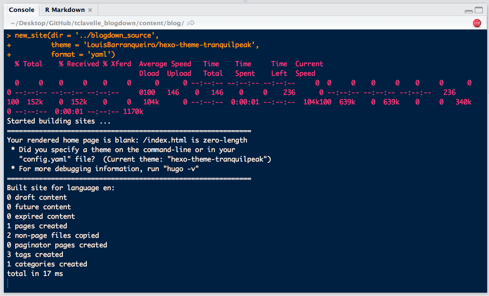

When I first started learning to code in R, Google was (and still is) my go-to when I had a question. It didn't take long to realize that this generally brought me to one of two destinations - StackOverflow or [Insert Name]'s Blog. So, I created a StackOverflow account and decided to start my own data science blog. However, I didn't quite know where to start and spent most of 2016 scoping different platforms. While I won't go into all the details of this process, the cliff notes are as follows:

+ Tried Jekyll. The installation and dependencies (e.g. Ruby) were more complicated than I wanted and I was hoping for a more direct integration of R into the workflow
+ Created a website with RMarkdown. Getting setup was a breeze but found the blogging capability to be lacking

Enter [blogdown](https://github.com/rstudio/blogdown), the new brainchild of Yihui Xi. Though still in the early beta stage, blogdown checked all the boxes I was looking for. So, now that i'm up and running, it felt only natural to write my first blog post about how to get started blogging with `blogdown`. [Blogdown](https://github.com/rstudio/blogdown) is a R package that combines the ease of [RMarkdown](http://rmarkdown.rstudio.com) with the flexibility and customizability of [Hugo](https://gohugo.io). Hugo is an open-source static site generator similar to Jekyll, which means it builds your website once rather than each time a user visits it by taking all files within the website's directory and rendering a complete website.

## Hosting Your Blog With GitHub
Before I jump in to explaining how to use `blogdown`, I want to first explain my approach to hosting my blog on GitHub, as it is important for the remainder of this post. User pages on GitHub require all site content (and only site content) to be on the `master` branch. This is problematic for `blogdown` sites because when Hugo builds your website it places the site conent in a new folder called `public/`. Thus, your blog's source and site content will be on the `master` branch and GitHub will be unable to render your site. So far i've seen two options for getting around this issue:  

1. **Two branches (and a subbranch) -** Remove all source content from the `master` branch and place it in a new branch, using a `subbranch` to mirror the `public/` folder on the new branch to the `master` branch. While this method allows you to store all your content in the same repo, it's rather confusing to set up if you're not a GitHub ninja.   

2. **Two repositories -** Create a repo to store your source content and tell `blogdown` to publish the site to your `username.github.io` repository each time you build your site. Though this approach is less streamlined than the two-branch method, the only real added hassle is remembering to push an additional repository to GitHub.

After initial partly-successful attempts to use the two-branch method, I decided to keep it simple and use the two repository method for my site. If you decide to go the two-branch route, see [this](https://proquestionasker.github.io/blog/Making_Site/) great post by Amber Thomas (which was my primary resource) and [this](https://hjdskes.github.io/blog/deploying-hugo-on-personal-gh-pages/index.html) post by Jente Hidskes. 

## Creating Your Blog
Ok, now that we've decided to use the two repository method to host our site, let's get started making a blog with `blogdown`. 

### Create a GitHub Repository
First, create a new repository for your blogdown source content. Initialize the repository with a `README.md` file. 

```{r echo = FALSE, fig.align = "center"}
knitr::include_graphics("img/create_repo.png")
```

Next, click the green `clone or download` button on the right side of your new repo's page and copy the URL.

```{r echo = FALSE, fig.align = "center"}
knitr::include_graphics("img/clone_repo.png")
```

Open up Terminal and use `cd <desired directory>` to navigate to the directory where you'd like your new repository to live. I keep all my repos in a `GitHub/` folder on my desktop, so i'll put the repository there. After navigating to the desired directory, run `git clone <GitHub URL>` to clone the new repository. 

```{r echo = FALSE, fig.align = "center"}
knitr::include_graphics("img/terminal_clone.png")
```

Open up *Finder*; you should now see the `blogdown_source/` folder containing only the `README.md` file. Now that you've successfully cloned the repo, delete the `README.md` file. Don't add anything else to this folder just yet, we'll let `blogdown` handle that part.

### Installing Hugo
A great feature of `blogdown` is that it handles the installation of Hugo for you, which means you don't need to know much about Hugo to start blogging with `blogdown`. I found this to be a big advantage over the complicated dependencies and installation process of Jekyll. 

```{r, echo=TRUE, eval=FALSE}
# Load blogdown package and install Hugo
library(blogdown)
install_hugo()
```

### Build Your Site with Blogdown
Like `install_hugo`, blogdown provides the handy `new_site()` function to automatically create the required structure for you website in the directory you specify. Another great feature of this function is that you can use the `theme` argument to specify the theme you want for your website and `blogdown` will download all neccessary files into the new site directory it creates. Check out Hugo's [theme](http://themes.gohugo.io) gallery for a ton of options. Let's try the [Tranquilpeak theme](http://themes.gohugo.io/hugo-tranquilpeak-theme/) theme, which we specify with `theme = 'kakawait/hugo-tranquilpeak-theme'`, which is just the GitHub user and repo name for the theme. We'll also set the `format` argument to `format = 'toml'` to tell `blogdown` that we want to use **toml** for our site's `config` file. `toml` is actually the default setting but I wanted to point it out because the `config.toml` is important for customizing your website. More on this in a bit.

```{r, echo=TRUE, eval=FALSE}
# Create new site in our recently cloned blogdown repository
new_site(dir = 'blogdown_source', 
         theme = 'kakawait/hugo-tranquilpeak-theme',
         format = 'toml')
```

A few things happen upon running the above code. R will add all the required Hugo components to the previously empty directory, displaying the progress in your R console. An example RMarkdown `post` will open automatically and RStudio will start serving your site in the RStudio Viewer, which you can open in your web browser by clicking on the arrow button next to the broom.

```{r echo = FALSE, fig.align = "center"}

```

Congratulations! You now have a functioning website created with `blogdown`! However, before you start going crazy customizing your new site and writing blog posts, let's first understand a bit more about how **Hugo** and `blogdown` work together to organize and build your site.

## Site Structure
Open up your repository folder. You should see a bunch of new folders and files, including for the theme you told `blogdown` to use for your website. 

```{r echo = FALSE, fig.align = "center"}
knitr::include_graphics("img/repo_structure.png")
```

While you should definitely see [Hugo's documentation](https://gohugo.io/overview/source-directory/) for details on the purpose of these directories, i'll explain the key elements you need to understand to get started with `blogdown`.

+ [config.toml](https://gohugo.io/overview/configuration/) - The configuration file for your website. This file tells Hugo how it should render your site, as well as define its menus, and set various other site-wide parameters. 
+ [themes](https://gohugo.io/themes/overview/) - User generated themes powered by the Go template library. You should see a folder with the name of the theme you chose previously
+ [content/](https://gohugo.io/content/organization/) - The main directory where your blog's content will live. Each page of your site should exist as a subdirectory of `content/`. Each subdirectory will consist of either a single `index.md` (or `index.html`) file, or a series of files representing multiple posts of the same content type  
+ [layout/](https://gohugo.io/templates/overview/) - HTML templates that Hugo uses to structure the layout of each page on your website. There are three primary layouts - **single** (for single-content pages), **list** (for pages with multiple pieces of content), and **homepage** (self explanatory).  
+ `public/` - The directory where Hugo will place your rendered website. The contents of the `public/` directory are the only things that can be present on the `master` branch of your *username.github.io* page in order for GitHub to render the site properly. More on this in a bit.

Once you've installed Hugo and created a new site, you're ready to start customizing your site and adding content with `blogdown`!

## Creating New Content


